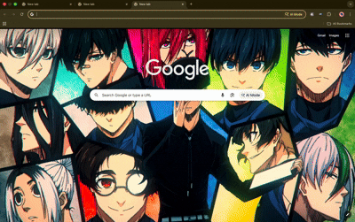

# Private AI Assistant

A Chromium-based browser extension that brings AI assistance directly to your browser using locally-running AI models. Get fast, private responses without sending data to external services.

## 🎯 Purpose

This is a **personal browser extension application** that provides quick access to local AI models via a simple popup interface. It integrates AI capabilities directly into Chrome for seamless assistance.

**Type:** Private (for personal/local use)

## ✨ Features

- **Local AI Processing** - All queries are processed locally on your machine
- **Private & Secure** - No data sent to external services
- **Conversation History** - Auto-saves up to 50 recent Q&A conversations
- **Persistent Storage** - History saved across browser sessions
- **Dark Mode Support** - Auto-detects system theme preference
- **Robust Error Handling** - Clear, actionable error messages
- **Request Timeout** - 30-second timeout with helpful feedback
- **Input Validation** - Prevents invalid or oversized requests
- **Fast Responses** - Direct communication with localhost AI server
- **Simple UI** - Clean, minimal popup interface (300px width)
- **Zero External Dependencies** - Works offline after model installation

## 🚀 Preview



## 🛠 Prerequisites

Before using this extension, ensure you have:

1. **Chromium-based Browser** (v90+) - Chrome, Edge, Brave, Opera, or Vivaldi
2. **Ollama** installed and running locally
   - Download: https://ollama.ai
   - Default endpoint: `http://localhost:11434`

3. **At least one Ollama model** pulled (e.g., `llama3:latest`)
   ```bash
   ollama pull llama3:latest
   ```

## 📦 Installation

1. Clone or download this repository
2. Open your browser and go to `chrome://extensions/` (or equivalent in your browser)
3. Enable **Developer mode** (toggle in top right)
4. Click **Load unpacked**
5. Select this folder (`private-ai-chromeextension`)
6. The extension icon will appear in your browser toolbar

## 🚀 Usage

1. **Start Ollama** on your machine
   ```bash
   OLLAMA_ORIGINS="*" ollama serve
   ```

2. **Click the extension icon** in your browser toolbar

3. **Type your question** in the text area

4. **Click "Ask AI"** to get a response

5. **Wait for the response** to appear below

### Using Conversation History

- **View History** - Scroll through past conversations at the bottom
- **Reload Conversation** - Click any history item to reload the question
- **Delete Item** - Click the ✕ button to remove a specific conversation
- **Clear All** - Click "Clear All" button to delete entire history (with confirmation)
- **Auto-Save** - Every successful response is automatically saved

### Dark Mode

The extension automatically detects your system theme preference. If your OS is set to dark mode, the extension will use a dark theme. Light mode is used by default.

## 📁 Project Structure

```
private-ai-chromeextension/
├── src/
│   ├── popup/               # Popup UI files
│   │   ├── popup.html       # UI structure
│   │   ├── popup.js         # Event handlers & communication
│   │   └── style.css        # Styling
│   │
│   └── background/          # Background service worker
│       └── background.js    # AI API communication
│
├── manifest.json            # Chrome extension manifest (MV3)
├── README.md               # Documentation (this file)
├── .gitignore              # Git ignore patterns
└── LICENSE                 # License information
```

## 🔧 Configuration

### Changing the AI Model

Edit `src/popup/popup.js` and change the model name:

```javascript
model: "llama3:latest"  // Change this to your preferred model
```

Available models can be listed with:
```bash
ollama list
```

### Changing Ollama Server Address

Edit `src/background/background.js` and update the fetch URL:

```javascript
const response = await fetch("http://localhost:11434/api/generate", {
```

## 🐛 Troubleshooting

### "Ollama request timed out. Is Ollama running?"
- Ensure Ollama is running: `ollama serve`
- Check that the model exists: `ollama list`
- Verify Ollama is accessible at `http://localhost:11434`
- Allow up to 30 seconds for large model responses

### "Cannot connect to Ollama. Make sure it's running..."
- Start Ollama: `ollama serve`
- Verify connection: Visit `http://localhost:11434` in your browser
- Check firewall settings
- Ensure no other service is blocking port 11434

### "Model not found. Did you pull it?"
- List available models: `ollama list`
- Pull the model: `ollama pull llama3:latest`
- Verify model name in extension (default: `llama3:latest`)

### "Please enter a valid question (1-5000 characters)"
- Ensure your input is not empty
- Maximum question length is 5000 characters
- Try a shorter, clearer question

### History not saving
- Ensure Chrome extension has storage permission
- Check available disk space
- Clear browser cache: Settings → Privacy → Clear browsing data

### Slow responses
- Ollama response time depends on model size and hardware
- Using smaller models (e.g., `neural-chat`) speeds up responses
- Larger models provide better quality but take longer
- Try using GPU acceleration if available

### Error clearing history
- Try refreshing the extension (chrome://extensions)
- Close and reopen the popup
- Check DevTools (F12) for specific error messages

## 📝 Development

### Debugging

1. Open the extension details page: `chrome://extensions/`
2. Click on your extension
3. Click **"service worker"** to see background logs
4. Click the extension popup and press **F12** for popup logs

### Making Changes

1. Edit files in `src/popup/` or `src/background/`
2. Go to `chrome://extensions/`
3. Click the refresh icon on your extension
4. Test the changes

### Common Development Tasks

- **Change popup styling**: Edit `src/popup/style.css`
- **Update UI elements**: Edit `src/popup/popup.html`
- **Modify behavior**: Edit `src/popup/popup.js` or `src/background/background.js`

## 📋 Manifest Overview

This extension uses **Manifest V3** (MV3), the latest web extension standard supported by all Chromium browsers:

- **Permissions**: `storage` - for data persistence
- **Host Permissions**: `http://localhost:11434/*` - to access local AI server
- **Background Worker**: Service worker for API calls
- **UI**: Single popup window

## ⚠️ Limitations & Notes

- **Requires Ollama** - An AI server must be running locally
- **Localhost Only** - Limited to `http://localhost:11434` (not remote servers)
- **No Streaming** - Responses are complete, not streamed
- **30-Second Timeout** - Requests exceeding 30 seconds will timeout
- **5000 Character Limit** - Input questions limited to 5000 characters
- **50 History Limit** - Conversation history stores up to 50 items
- **Response Latency** - Depends on model size and system hardware
- **Single Model** - Currently configured for one model at a time (set in code)

## 🔒 Privacy

All communication happens locally between your browser and the AI server running on your machine. No data leaves your computer.

## 📄 License

This project is released under the **Unlicense** – it is in the public domain. You are free to use, modify, and distribute this software without any restrictions or obligations.

For more information, see [unlicense.org](https://unlicense.org)

## 🤝 Contributing

This is a personal project. For suggestions or issues, feel free to use GitHub Issues.

## 🎓 Learning Resources

- [Chrome Extension Documentation](https://developer.chrome.com/docs/extensions/)
- [Manifest V3 Guide](https://developer.chrome.com/docs/extensions/mv3/)
- [Ollama Documentation](https://github.com/ollama/ollama)
